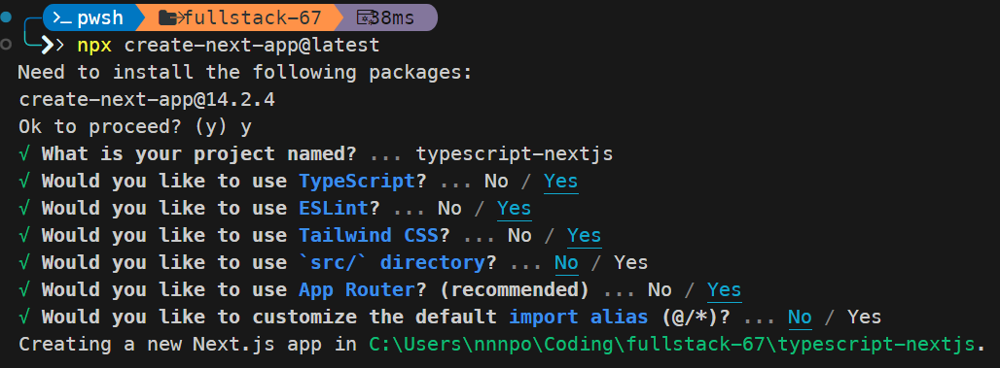

<style>
@import url('https://fonts.googleapis.com/css2?family=Prompt:ital,wght@0,100;0,300;0,400;0,700;1,100;1,300;1,400;1,700&display=swap');

    :root {
    font-family: Prompt;
    --hl-color: #D57E7E;
}
h1 {
  font-family: Prompt
}
</style>

# Fullstack Development

---

## 

---

# History

- https://roadmap.sh/guides/history-of-javascript

---

# Where is `JS`?

- Browser
  - Manipulate DOM.
- Host OS
  - JavaScript runtimes ([NodeJS](https://nodejs.org/en), [Bun](https://bun.sh/))

---

# Activity

- Run `console.log` in a browser and in an OS.

---

# Learning JS

- https://roadmap.sh/javascript
- https://roadmap.sh/questions/javascript

---

## 

---

# What is TypeScript?

- TypeScript is a super set of JavaScript.

---

# Why TypeScipt?

- Improves your productivity while helping avoid bugs.
  - Catch bugs at the compile-time instead of at runtime.
- Brings the future JavaScript to today.
  - You can use the new JavaScript features before web browsers (or other environments) fully support them.

---

# How it works?

1. Write TypeScript codes. (`.ts` files)
2. Compile the TypeScript codes into plain JavaScript codes (`.js` files) using a TypeScript compiler.
3. Run JavaScript codes in an environment that JavaScript runs.

---

# Tools

- TypeScript Playground: https://www.typescriptlang.org/play
- VSCode Extension: `Quokka.js`
- VSCode Extension: `Paste JSON as Code`

---

# Basic

---

# Defining types

- Types by inference
  - TypeScript knows the JavaScript language and will generate types for you in many cases.
- Type by specification
  - We define it ourselves.

---

# Type by inference

```js
const user = {
  name: "Hayes",
  id: 0,
};
```

- TypeScript already knows the type of this variable.

---

# Type by specification

```js
interface User {
  name: string;
  id: number;
}
```

or

```js
type User = {
  name: string,
  id: number,
};
```

---

# `type` vs `interface`

- They are very similar, and for the most common cases act the same.
- However, TypeScript doc recommends `interface`.
  - `interface` provides better error message.
  - `interface` can be extended.

---

# Type annotation

```js
const user: User = {
  name: "Hayes",
  id: 0,
};
```

---

# Type annotation

- You can use interfaces to annotate parameters and return values to functions.

```js
function deleteUser(user: User) {
  // ...
}
```

---

# Composing types

```js
type Props = string | null;
type Role = "ADMIN" | "USER";
```

---

# Generics

Generics provide variables to types.

```js
interface Backpack<Type> {
  add: (obj: Type) => void;
  get: () => Type;
}
```

---

# Try

```js
const backpack: Backpack<string> = {
  add: (myStr) => {},
  get: () => {
    return "Hi";
  },
};
```

---

# Use Typescript in NodeJS project

---

- `npm init -y`
- `npm install -D typescript ts-node`
- Create `./src` and `.dist` directory

---

- Create `./src/index.ts`

```js
function sayHello(name: string) {
  console.log("Hello " + name);
}

sayHello("World");
```

---

## Compile

- `npx tsc src/index.ts --outDir dist`

## Run (node)

- `node ./dist/index.js`

## Run (ts-node)

- `npx ts-node ./src/index.ts`

---

# Use `tsconfig.json`

- `npx tsc --init`
- set `"outDir": "./dist",`
- Now just type `npx tsc`

---

# Code

```js
async function getData() {
  const res = await fetch("https://jsonplaceholder.typicode.com/todos/1");
  return await res.json();
}

getData().then((data) => console.log(data));
```

---

# Code

```js
import fs from "fs";

const dir = fs.readdirSync(__dirname);
console.log(dir);
```

- If you don't have `ts-node`, you need to `npm install -D @types/node`

---

# From JS class (last time)

[Source](https://github.com/ChayaninSuatap/26x497-javascript-starter/blob/master/example02.js)

---

```js
const a = [1, 2, 5, 7];
console.log(a[5]); // Returns undefined
const student = {
  name: "john",
  gender: "Male",
};
console.log(student.age); // Returns undefined
function square1(x) {
  const result = x * x;
}
console.log(square1(2));
function square2(x) {
  console.log(x); // Returns undefined
  return x * x;
}
square2();
```

---

# TypeScript - NextJS

---

# Installation

`npx create-next-app@latest`



---

`tsconfig.json`

```json
{
  // ...
  "paths": {
    "@app/*": ["./app/*"],
    "@components/*": ["./components/*"]
  }
}
```

---

`./app/page.tsx`

```js
import Card from "@components/card";

export default function Home() {
  return (
    <div className="container flex m-2 gap-2">
      <Card title="Card 1" />
      <Card title="Card 2" text="Content Here" />
    </div>
  );
}
```

---

`./components/card.tsx`

```js
import { FC } from "react";

interface Props {
  title: string;
  text?: string;
}
const Card: FC<Props> = ({ title, text }) => {
  return (
    <div className="border border-gray-300 p-2 rounded shadow-sm">
      <div className="font-bold text-lg text-gray-800">{title}</div>
      <div className="text-gray-600">{text || "...."}</div>
    </div>
  );
};

export default Card;
```
