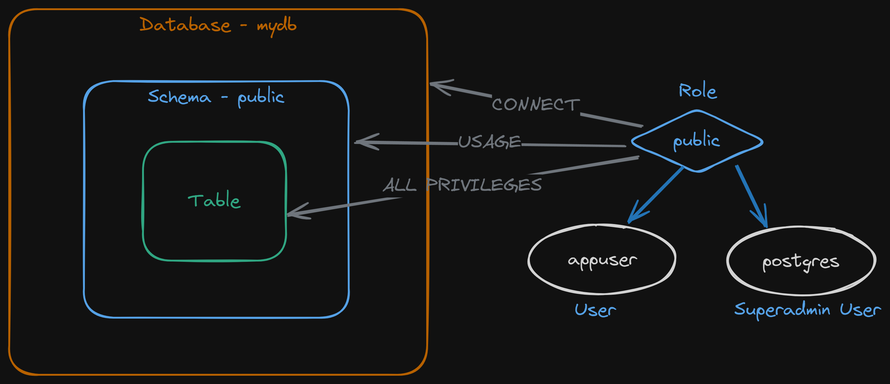
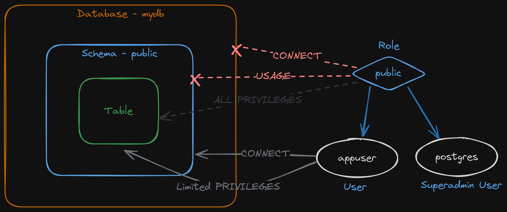

<style>
@import url('https://fonts.googleapis.com/css2?family=Prompt:ital,wght@0,100;0,300;0,400;0,700;1,100;1,300;1,400;1,700&display=swap');

    :root {
    font-family: Prompt;
    --hl-color: #D57E7E;
}
h1 {
  font-family: Prompt
}
</style>

# Fullstack Development

---

# Preflight project - database

---



---



---

```bash
psql -U postgres #Connect to "postgres" database
psql -U postgres -d mydb
```

```sql
\connect mydb
REVOKE CONNECT ON DATABASE mydb FROM public;
REVOKE ALL ON SCHEMA public FROM PUBLIC;
CREATE USER appuser WITH PASSWORD '1234';
GRANT CONNECT ON DATABASE mydb TO appuser;
GRANT USAGE ON SCHEMA public TO appuser;
```

---

```sql
CREATE TABLE test();
GRANT SELECT, INSERT, UPDATE, DELETE ON ALL TABLES IN SCHEMA public TO appuser;
```

- This does not automatically give permission to the tables create after this.
