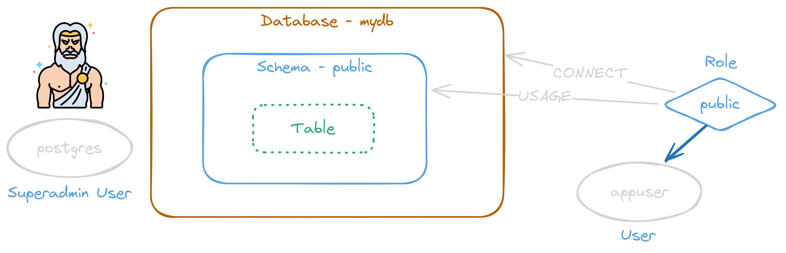

<style>
@import url('https://fonts.googleapis.com/css2?family=Prompt:ital,wght@0,100;0,300;0,400;0,700;1,100;1,300;1,400;1,700&display=swap');

    :root {
    font-family: Prompt;
    --hl-color: #D57E7E;
}
h1 {
  font-family: Prompt
}
</style>

# Fullstack Development

---

# Preflight project - database

---

# Prerequisite

- Docker
  - Docker desktop
- Database management tools
  - Dbeaver

---

# Spinning up database instance

- Files

  - 💾 `./.env` Copy from [here](https://github.com/fullstack-67/pf-db/blob/main/.env.example).

  - 💾 `./.gitignore` [(link)](https://github.com/fullstack-67/pf-db/blob/main/.gitignore)

  - 💾 `./docker-compose.yml` [(link)](https://github.com/fullstack-67/pf-db/blob/main/docker-compose.yml)

- ⌨️ `docker compose up -d`

---



---


---


---

# DB user management

- `docker exec -it postgres_container bash`
- `psql -U postgres -d mydb`

```sql
REVOKE CONNECT ON DATABASE mydb FROM public;
REVOKE ALL ON SCHEMA public FROM PUBLIC;
CREATE USER appuser WITH PASSWORD '1234';
CREATE SCHEMA drizzle;
GRANT ALL ON DATABASE mydb TO appuser;
GRANT ALL ON SCHEMA public TO appuser;
GRANT ALL ON SCHEMA drizzle TO appuser;
```

---

# ORM

- `npm init -y`
- `npm i drizzle-orm postgres dotenv`
- `npm i -D drizzle-kit`
- `npm i typescript ts-node tsconfig-paths`

---

# Typescript

`npx tsc --init`

```json
{
  "ts-node": {
    "require": ["tsconfig-paths/register"]
  },
  "compilerOptions": {
    // ...
    "baseUrl": "./",
    "paths": {
      "@db/*": ["./db/*"]
    }
    // ...
  }
}
```

---

# Database init

- Files
  - `./db/utils.ts`
  - `./db/schema.ts`
  - `./drizzle.config.ts`
- `npx drizzle-kit push`

---

# Migration

- `./db/migrate.ts`
- `npx drizzle-kit generate`

---

# CRUD

- `./db/client.ts`
- `./db/prototype.ts`
