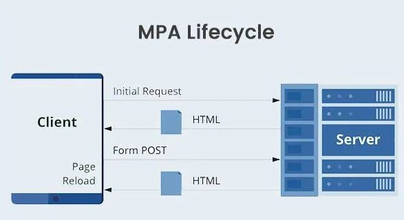
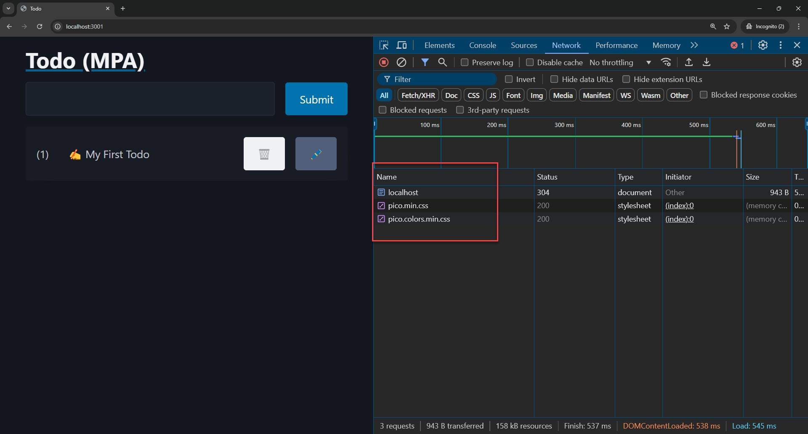
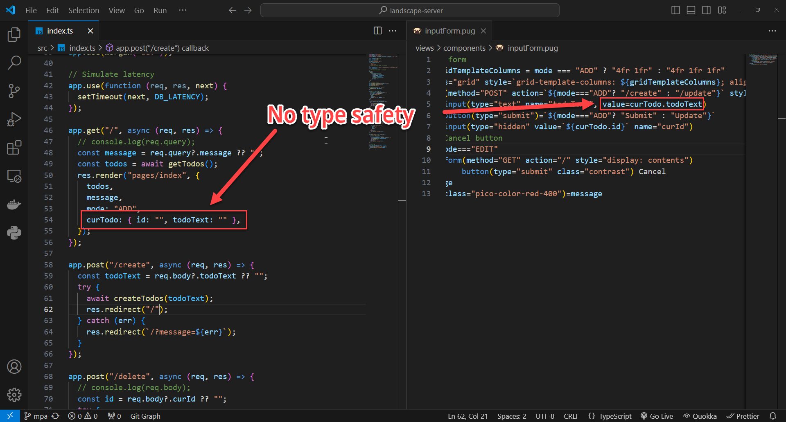
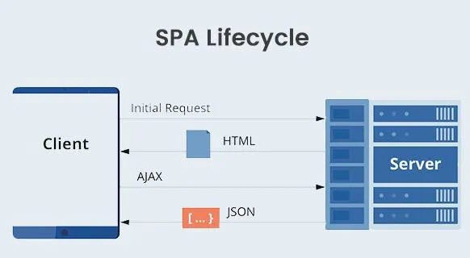
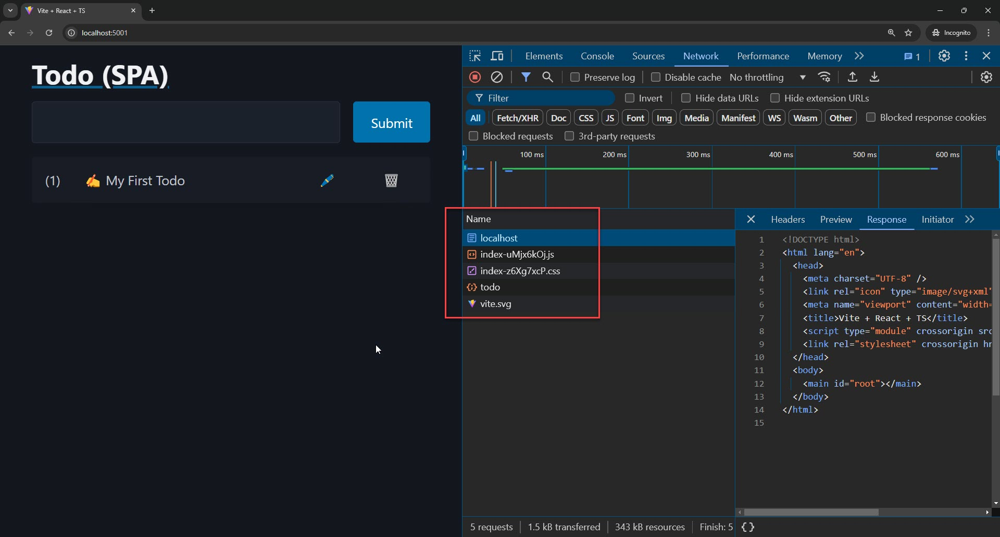

<style>
@import url('https://fonts.googleapis.com/css2?family=Prompt:ital,wght@0,100;0,300;0,400;0,700;1,100;1,300;1,400;1,700&display=swap');

    :root {
    font-family: Prompt;
    --hl-color: #D57E7E;
}
h1 {
  font-family: Prompt
}
</style>

# Fullstack Development

---

# Fullstack Landscape

> How to over-engineer "todo" apps

---

# Round 1

> Multi-Page Application (MPA) vs Single-Page Application (SPA)

---

# Multi-page application

- Loads a new page every time you perform an action.
- Traditional web applications.
- Use server-side technologies
  - PHP, Ruby on Rails, ASP.NET, Java, and Node JS.
- Can include JavaScript (`script`) for client-side interactivity

---



---

# Todo app (MPA)

- `Express JS` + `Pug` (renderer)

---

# Get started

- `npm install -g pnpm`
  - I am using `pnpm`.
- `git clone -b mpa https://github.com/fullstack-67/landscape-server`
- `cd landscape-server`
- `pnpm install`
- `npm run dev`

---

# Endpoint

`./src/index.ts`

```ts
app.get("/", async (req, res) => {
  const message = req.query?.message ?? "";
  const todos = await getTodos();
  // Output HTML
  res.render("pages/index", {
    todos,
    message,
    mode: "ADD",
    curTodo: { id: "", todoText: "" },
  });
});
```

---

# Renderer

`./view/pages/index.pug`

```ts
body
    main(class="container")
        a(href="/")
            h1 Todo (MPA)
        div(id="todoform")
            include ../components/inputform.pug
        div(id="todolist")
            include ../components/todolist.pug
```

---



_Use incognito mode to avoid loading chrome extensions._

---

# Note

- Every button is wrapped in a separate form
  - Need to trigger different endpoints.
- Need to use `input(type="hidden)` to encode additional information.

```js
form(action="/delete" method="POST" style="display: contents")
  input(type="hidden" value=`${todo.id}` name="curId")
  button(type="submit" class="contrast" style="margin-bottom: 0") 🗑️
form(action="/edit" method="POST" style="display: contents")
  input(type="hidden" value=`${todo.id}` name="curId")
  button(type="submit" class="secondary" style="margin-bottom: 0") 🖊️
```

---



---

# Single-page application

- Single-page application
  - Loads a single HTML page and dynamically updates the content as the user interacts with the app.
- Use frontend and backend frameworks separately.

---



---

# Todo app (SPA)

- `Express JS` + `React`

---

# Get started

- `git clone https://github.com/fullstack-67/landscape-spa`
- Backend
  - `cd backend`
  - `pnpm install`
  - `npm run dev`
- Frontend
  - `cd frontend`
  - `pnpm install`
  - `npm run build`
  - `npm run preview`

---



---

# App comparison (UX)

| Item              | MPA | SPA |
| ----------------- | --- | --- |
| No page-refresh   | ❌  | ✅  |
| Spinner           | ❌  | ✅  |
| Element disabling | ❌  | ✅  |

---

# App comparison (technical)

| Item                  | MPA | SPA |
| --------------------- | --- | --- |
| Amount of `JS` loaded | ✅  | ❌  |
| HTML content (SEO)    | ✅  | ❌  |
| State in URL          | ✅  | ❌  |

---

# DX

| Item                 | MPA        | SPA     |
| -------------------- | ---------- | ------- |
| Number of frameworks | 1 ✅       | 2 ❌    |
| Complexity           | Less ✅    | More ❌ |
| Lines of code        | Less ✅    | More ❌ |
| Type Safety          | Less ❌    | More ✅ |
| Hot reloading        | Partial ❌ | Full ✅ |

---

# DX - Notes

- Type safety
  - MPA: Not type safe in the renderer. (Scary)
  - SPA: Still need to take care of frontend/backend interface.

---

# Amount of Codes

| Dir              | # Files | Total Lines |
| :--------------- | ------: | ----------: |
| _MPA_            |         |             |
| `./src`          |       2 |         161 |
| `./views`        |       3 |          42 |
| _SPA_            |         |             |
| `./backend/src`  |       2 |         144 |
| `./frontend/src` |      10 |      😭 360 |

---

# Round 2

> Back to the server.

---

- React Server Components (RSC)
- RCS + Client Component

---

# Round 3

> Enlightment

---

- Hypermedia-driven application - HTMX
