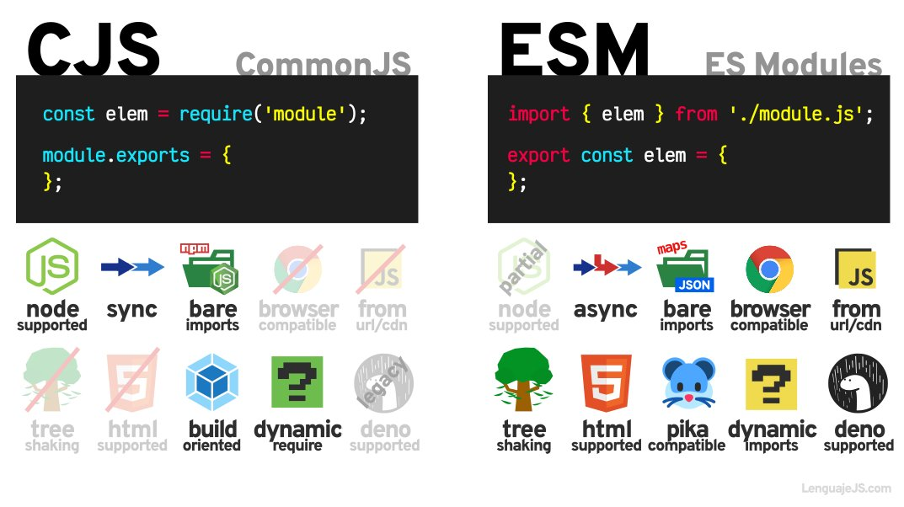

<style>
@import url('https://fonts.googleapis.com/css2?family=Prompt:ital,wght@0,100;0,300;0,400;0,700;1,100;1,300;1,400;1,700&display=swap');

    :root {
    font-family: Prompt;
    --hl-color: #D57E7E;
}
h1 {
  font-family: Prompt
}
</style>

# Fullstack Development

---

# CommonJS vs ES Modules

---

# CommonJS

- **Older** type of writing modules
- Popularized by `NodeJS`
  - `CommonJS` modules were the only supported style of modules in `NodeJS` up until version 12.

---

# Using CommonJS

- You can mark your file as a `CommonJS` module by either
  - Naming it with the `.cjs` extension
  - Using `type: "commonjs"` in `package.json` (default)

---

# CommonJS syntax

`onefile.cjs`

```js
module.exports.add = function (a, b) {
  return a + b;
};
```

`anotherfile.cjs`

```js
const { add } = require("./util");

console.log(add(5, 5)); // 10
```

---

# EcmaScript (ES) Modules

- EcmaScript standard way of writing modules.
  - Newer system
- Natively supported module style in browsers and all modern runtimes

---

# Using ESM

- You can mark your file as a `ES` module by either
  - Naming it with the `.mjs` extension
  - Using `type: "module"` in `package.json`

---

# ESM syntax

`util.mjs`

```js
export function add(a, b) {
  return a + b;
}
```

`app.mjs`

```js
import { add } from "./util.mjs"; // Note the extension is required.

console.log(add(5, 5)); // 10
```

---

# Comparison



---

# Comparison

https://dev.to/greenteaisgreat/the-ongoing-war-between-cjs-esm-a-tale-of-two-module-systems-1jdg

---

# TypeScript

https://www.typescriptlang.org/docs/handbook/modules/theory.html#module-resolution
