<style>
@import url('https://fonts.googleapis.com/css2?family=Prompt:ital,wght@0,100;0,300;0,400;0,700;1,100;1,300;1,400;1,700&display=swap');

    :root {
    font-family: Prompt;
    --hl-color: #D57E7E;
}
h1 {
  font-family: Prompt
}
</style>

# Fullstack Development

---

# Authentication / Authorization

---

# Authentication - `authen`

- A process of verifying user identity.
- Who is the user?
- Is the user really who he/she represents himself to be?

---

# Authorization - `author`

- A process of verifying a user’s access level.
- Is user `X` authorized to access resource `R`?
- Is user `X` authorized to perform operation `P`?

---

# Note

`authen` and `author` do not exist separately.

- Users try to access protected APIs:
  - Applications might need to allow user based on role (`author`) but also need to know user identities (`authen`).
- Social login (i.e. Google):
  - Users verify themselves to Google (`authen`) but authorize applications (`author`) to access their resources.

---

# Approach

Rather than talking about `authen` vs `author`, let's focus on requirements:

- How do users sign up/in with credentials?
- How do users sign up/in with social accounts?
- How do we persist users' auth states?
  - So that users don't need to sign in at every request.

---

# Part 1: Signing up/in with credential

---

# Situation

- User fill in username and password.
- Your app creates user entry in database.
- _How do you store password?_
  - (and also compare it?)

---

> Part 1: Signing up/in with credential

# Section 1A: How to store password

---

# 6 levels of safety

| Technique                        | Ranking | Vunerability         |
| :------------------------------- | :-----: | :------------------- |
| Plain text                       |    F    | All                  |
| Encryption                       |    D    | Stolen key           |
| Hashing                          |    C    | Rainbow table attack |
| Salting                          |    B    | Fast computer        |
| Salting + Cost Factor (`bcrypt`) |   B+    | _Infinity stone_ 🤣  |
| ?                                |    A    |                      |

Adapted from [source](https://youtu.be/qgpsIBLvrGY?si=bDSXaifIQ5aBjPyY)

---

# Note (1)

- [SHA256](https://emn178.github.io/online-tools/sha256.html)
- [Rawinbow table attack](https://en.wikipedia.org/wiki/Dictionary_attack#Pre-computed_dictionary_attack/Rainbow_table_attack)
- `bcrypt` hash
  

---

# Note (2)

- It should be noted that the resulting "hash" contain `salt`.
- This is good since so that we do not need to keep track of it.
- But this also leave room for hacker to use it to regenerate rainbow table on the fly.

---

# `bcrypt` example

- `git clone -b bcrypt https://github.com/fullstack-67/auth-mpa-v2.git auth-bcrypt`
- `pnpm i`
- `npx tsx ./src/hash.ts`
- `npx tsx ./src/compare.ts`

---

# Note on the code

- Promisify the callback style.
- Increasing time to generate (and compare) hash with incrasing `saltRounds`.
- The use of `bcrypt.compare`
- Use of `debug` package.

---

> Part 1: Signing up/in with credential

# Section 1B: Implementation with `passport`

---

# `passport`

- Most popular authentication middleware for `express`.
- Minimal and modular
- [500+ strategies](https://www.passportjs.org/) (click at button)
- Confusing and [poor documented](https://www.reddit.com/r/node/comments/vbuv2s/passportjs_alternatives_in_2022/?rdt=52617) 🤣
  - [Hidden manual](https://github.com/jwalton/passport-api-docs)

---

# Let's see it

- `git clone -b signin-credential https://github.com/fullstack-67/auth-mpa-v2.git auth-signin-credential`
- `pnpm i`
- `npm run db:reset`
- `npm run dev`

---

# Side note about the project

- MPA - HTMX
- Use `SQLite` + `drizzle`.
  - Checkout the schema.
- Try debugging in VSCode.
  - See `launch.json`.

---

# Highlighed packages

`package.json`

```json
{
  "passport": "^0.7.0",
  "passport-local": "^1.0.0"
}
```

---

# Middleware

`src/index.ts`

```ts
passport.use(
  new LocalStrategy(
    {
      // Options
    },
    async function (email, password, done) {
      // Verify email / password
    }
  )
);
//
app.use(passport.initialize());
```

[Available options](https://github.com/jaredhanson/passport-local?tab=readme-ov-file#available-options)

---

# Route

```ts
app.post(
  "/login",
  passport.authenticate("local", { session: false }),
  function (req, res) {
    // * Passport will attach user object in the request
  }
);
```

---


---

# Can we do better?

---

| Technique                        | Ranking | Vunerability         |
| :------------------------------- | :-----: | :------------------- |
| Plain text                       |    F    | All                  |
| Encryption                       |    D    | Stolen key           |
| Hashing                          |    C    | Rainbow table attack |
| Salting                          |    B    | Fast computer        |
| Salting + Cost Factor (`bcrypt`) |   B+    | _Infinity stone_     |
| **Not storing password**         |    A    | 👈👈👈               |

---

# Part 2: Social signing up/in

---

# Something like this

_We need OAuth 2.0._


---

> Part 2: Social signing up/in

# Section 2A: OAuth 2.0

---

# OAuth 2.0


---

# OAuth 2.0

- "Open Authorization"
- Standard designed to allow application to access resources hosted by other web apps on behalf of a user.

  - Standard for `author`
  - Not for [`authen`](https://www.scottbrady91.com/oauth/oauth-is-not-authentication)

- Replaced OAuth 1.0 in 2012.

---

# OAuth 2.0

- Specifies many "flows"
  - **Authorization Code Flow**
  - Client Credentials Flow
  - Refresh Token Flow
  - JWT Bearer Flow
  - Device Code Flow
- We will use "Authorization Code Flow" for social login.

---

# Recommended resources

- https://engineering.backmarket.com/oauth2-explained-with-cute-shapes-7eae51f20d38

- https://developer.okta.com/blog/2019/10/21/illustrated-guide-to-oauth-and-oidc?utm_source=pocket_shared

- https://youtu.be/8aCyojTIW6U?si=YPxkcLPcAoK5jixI

- https://youtu.be/t18YB3xDfXI?si=pD1JnFP0GrnBXW2v

---

# Wait

> Are we using OAuth (standard for `author`) and **authorization** code flow for `authen`?

> Yes, we kind of "misusing" it.

---

# Authorization code flow

> In real life

---

# Setup

- You are a guest at a hotel.
- You already checked out.
- You forgot your stuff in the room.
- You want a porter to get your stuff for you.
  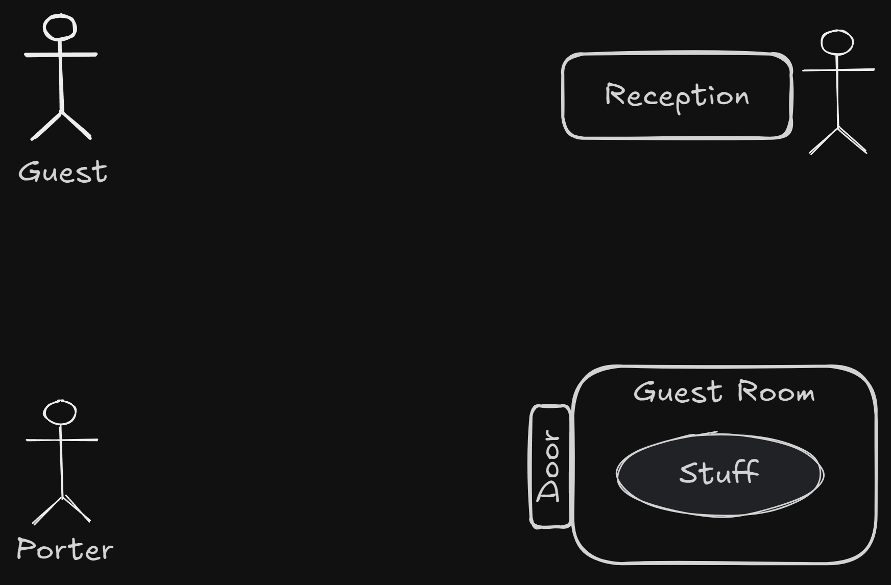

---

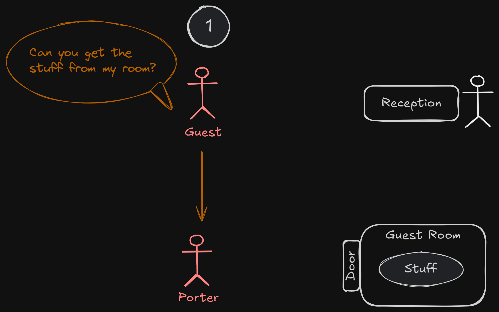

---


---

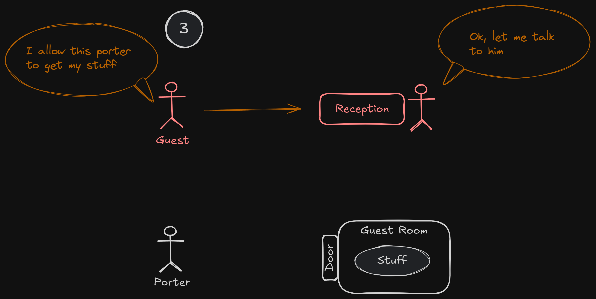

---

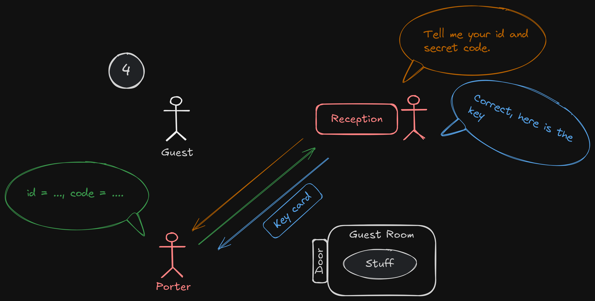

---


---

# Authorization code flow

- You (`guest`) authorize `porter` to access your resource.
- `porter` does not need to know who you are.
- The keycard reader at the door also doesn't need to have your information.

---

# Authentication?

- But what if the porter wants to know who you are.
- There are two ways.

---


_This is what we are using._
_Is there a better way?_

---

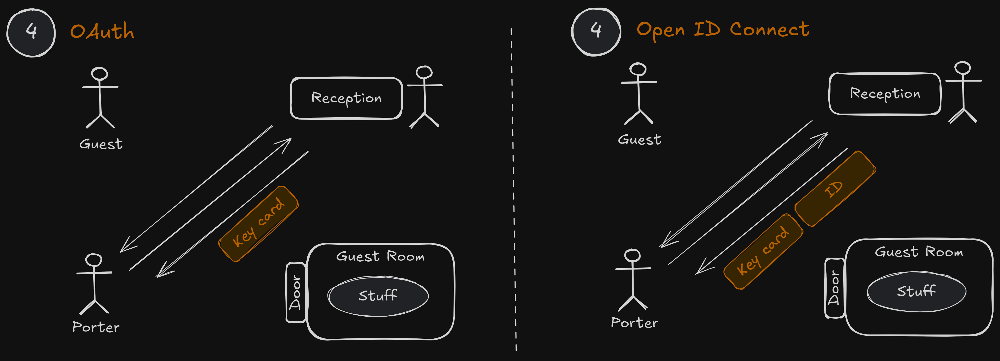

---

# OpenID Connect (OIDC)

- Thin layer that sits on top of OAuth 2.0
  - Adds login and profile information about the person who is logged in.
- When a "Authorization Server" supports OIDC, it is sometimes called an "Identity Provider".
- Not all servers support OIDC.

---

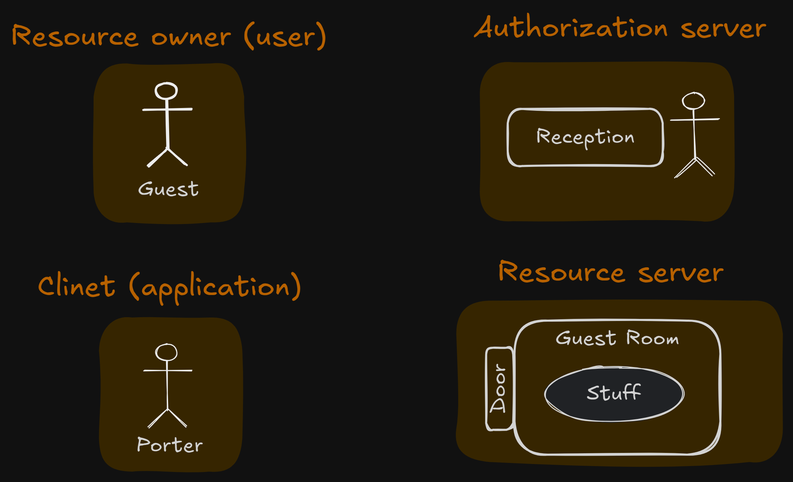

---

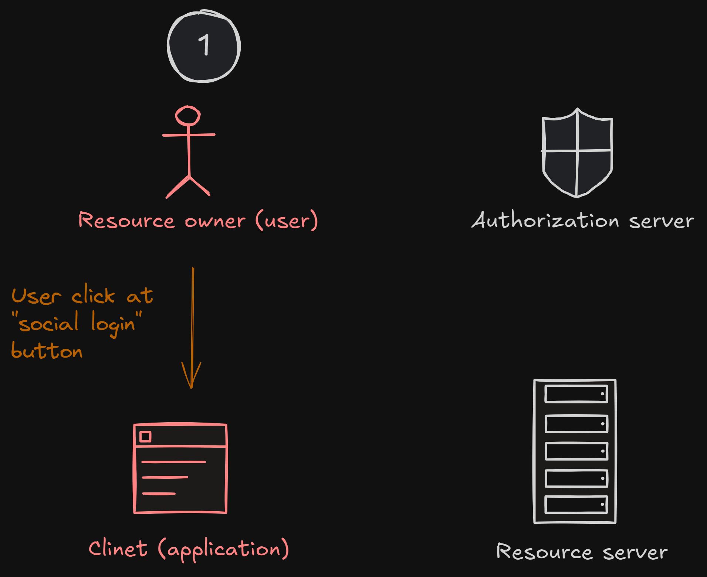

---


---

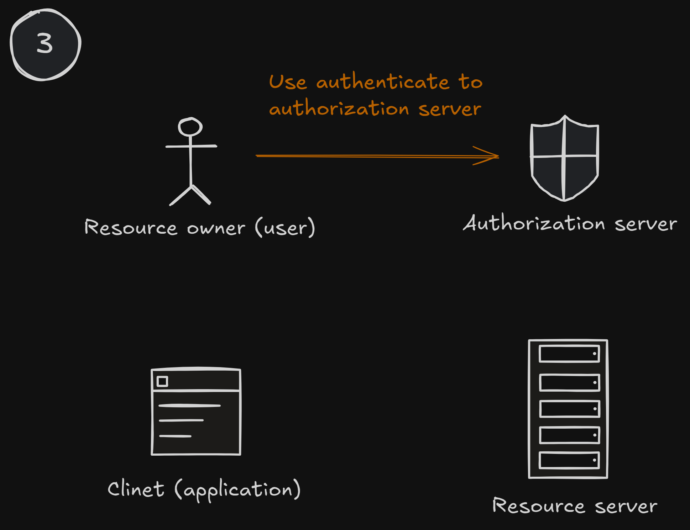

---


---

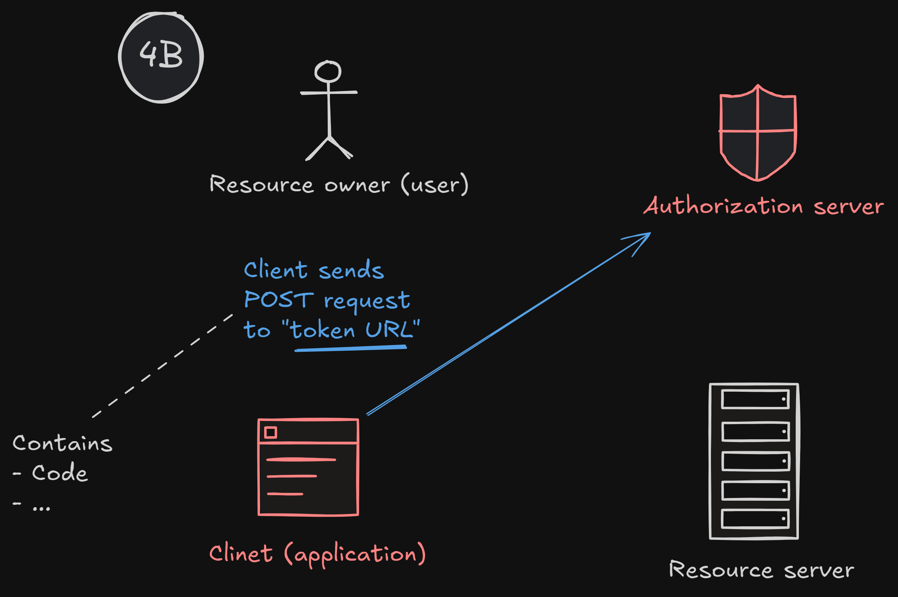

---

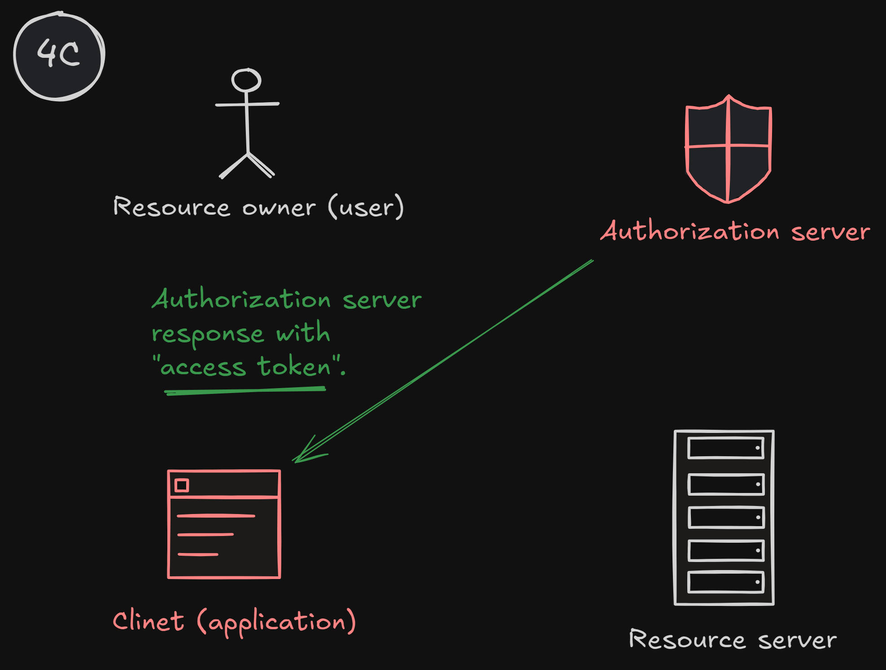

---

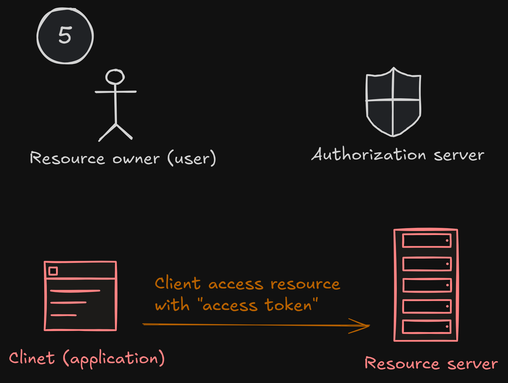

---

# Lab

---

# You need

- `Client ID`
- `Client Secret`
- `Scope`
- `Authoriation URL`
- `Callback URL`
- `Token URL`
- `Resource URL`

---

# Step 1:

- Register your app [here](https://github.com/settings/developers).

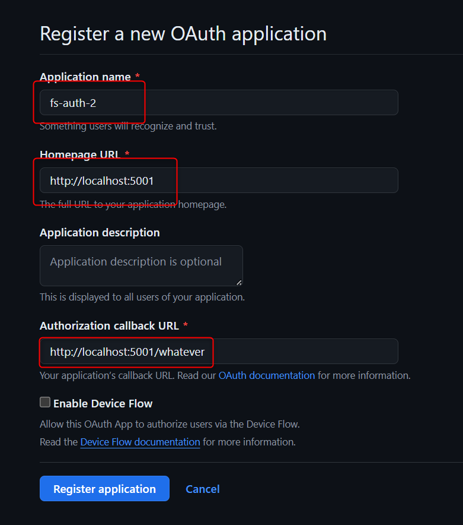

---

# Step 1:

- Get `Client ID` and `Client Secret`

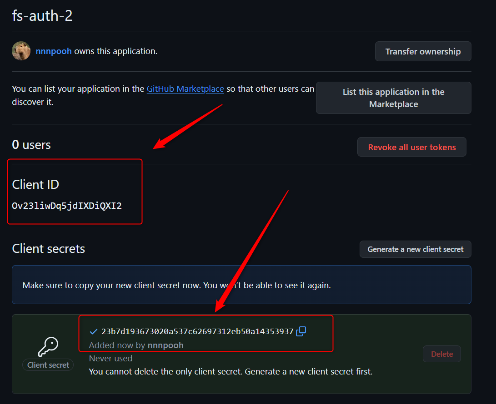

---

# Step 2

- Choose score
- Contruct `Authorization URL`
  - https://github.com/login/oauth/authorize?client_id=CLIENT_ID&redirect_uri=REDIRECT_URL&response_type=code&scope=user,user:email
