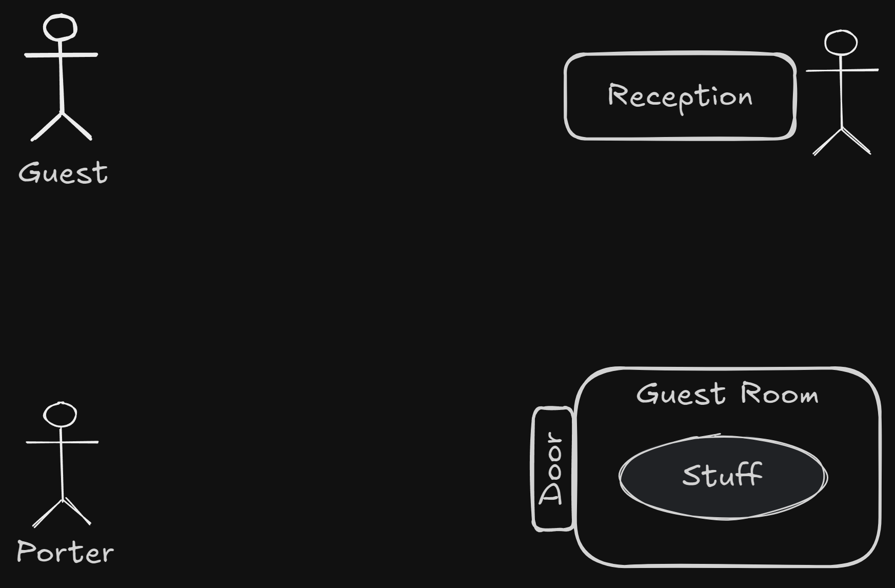
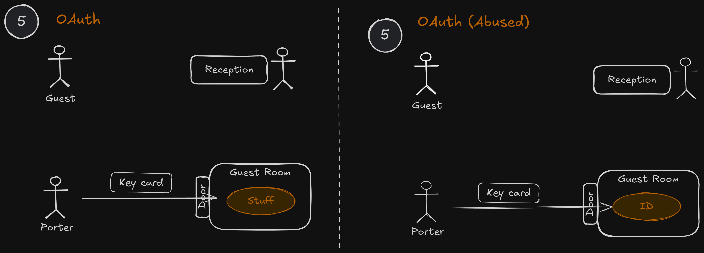
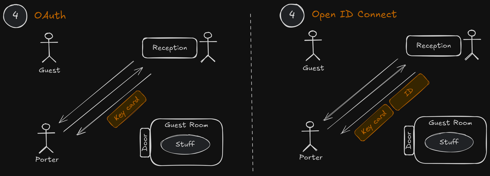
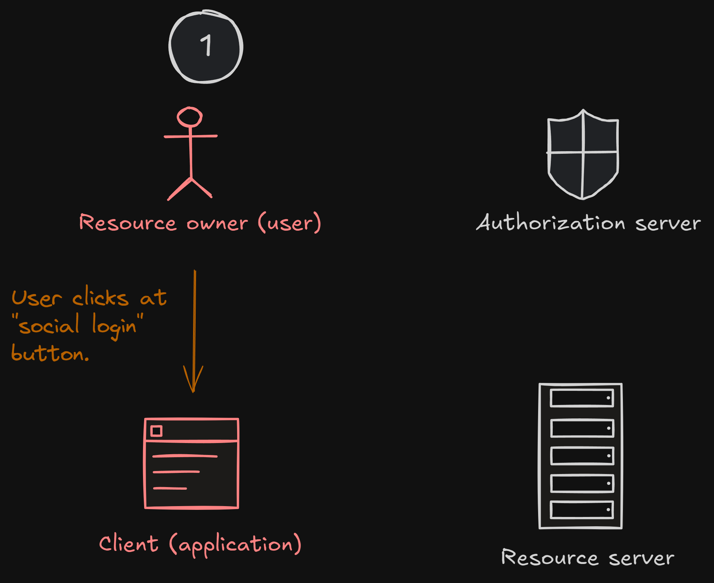
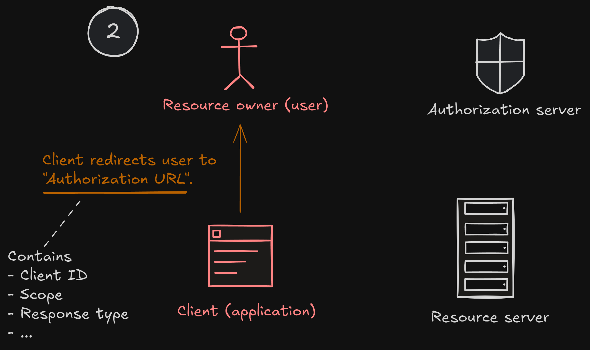
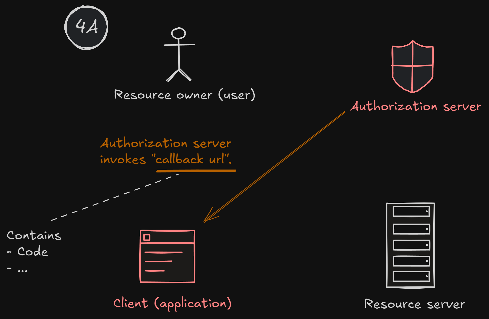

# Fullstack Development

---

# Authentication / Authorization

---

# Part 2: Social signing up/in

---

# Something like this

_We need OAuth 2.0._

---

> Part 2: Social signing up/in

# Section 2A: OAuth 2.0

---

# OAuth 2.0

---

# OAuth 2.0

- "Open Authorization"
- Standard designed to allow application to access resources hosted by other web apps on behalf of a user.

  - Standard for `author`
  - Not for [`authen`](https://www.scottbrady91.com/oauth/oauth-is-not-authentication)

- Replaced OAuth 1.0 in 2012.

---

# OAuth 2.0

- Specifies many "flows"
  - **Authorization Code Flow**
  - Client Credentials Flow
  - Refresh Token Flow
  - JWT Bearer Flow
  - Device Code Flow
- We will use "Authorization Code Flow" for social login.

---

# Recommended resources

- https://engineering.backmarket.com/oauth2-explained-with-cute-shapes-7eae51f20d38

- https://developer.okta.com/blog/2019/10/21/illustrated-guide-to-oauth-and-oidc?utm_source=pocket_shared

- https://youtu.be/8aCyojTIW6U?si=YPxkcLPcAoK5jixI

- https://youtu.be/t18YB3xDfXI?si=pD1JnFP0GrnBXW2v

---

# Wait

> Are we using OAuth (standard for `author`) and **authorization** code flow for `authen`?

> Yes, we kind of "misusing" it.

---

# Authorization code flow

> In real life

---

# Setup

- You are a guest at a hotel.
- You already checked out.
- You forgot your stuff in the room.
- You want a porter to get your stuff for you.
  

---

---

---

---

---

---

# Authorization code flow

- You (`guest`) authorize `porter` to access your resource.
- `porter` does not need to know who you are.
- The keycard reader at the door also doesn't need to have your information.

---

# Authentication?

- But what if the porter wants to know who you are.
- There are two ways.

---

_This is what we are using._
_Is there a better way?_

---

---

# OpenID Connect (OIDC)

- Thin layer that sits on top of OAuth 2.0
  - Adds login and profile information about the person who is logged in.
- When a "Authorization Server" supports OIDC, it is sometimes called an "Identity Provider".
- Not all servers support OIDC.

---

---

---

---

---

---

---

---

---

> Part 2: Social signing up/in

# Section 2B: Oauth 2.0 with Github (Lab)

---

# You will need

- `Client ID = ...`
- `Client Secret = ...`
- `Callback URL = http://localhost:5001/whatever`
- `Authoriation URL = ...`
- `Token URL = ...`
- `Resource URL`
  - `https://api.github.com/user`
  - `https://api.github.com/user/emails`
- `Access Token = ...`

---

# Setup

- Register your app [here](https://github.com/settings/developers).

- `Homepage URL` and `Callback URL` can be whatever for now.

---

# Setup

- Get `Client ID` and `Client Secret`

---

# Setup

- Choose [scope](https://docs.github.com/en/apps/oauth-apps/building-oauth-apps/scopes-for-oauth-apps).
  - `scope=user,user:email`
- Contruct `Authorization URL`

  - `https://github.com/login/oauth/authorize?client_id=CLIENT_ID&redirect_uri=REDIRECT_URL&response_type=code&scope=SCOPE`

---

# Setup

- Construct `Token URL` _(incompleted)_
  - `https://github.com/login/oauth/access_token?client_id=CLIENT_ID&client_secret=CLIENT_SECRET&code=CODE&redirect_uri=CALLBACK_URL`

---

# Let's go

---

# Step 2

- _(Skip 1 for now since there is no app.)_

- Goto at `Authorization URL`

---

# Step 3

- Authenticate with Github

---

# Step 4A

- Extract `code` and keep it.
- `code` is usually very short-lived.

---

# Step 4B

- Send `POST` request to `Token URL` with actual `Code`.
- [Reference](https://docs.github.com/en/apps/oauth-apps/building-oauth-apps/authorizing-oauth-apps#2-users-are-redirected-back-to-your-site-by-github)

---

# Step 4C

- Keep `Access Token` from the response.

---

# Step 5

- Send `GET` requestion to resouces.
- Use `Access Token` as bearer token.
- [Reference](https://docs.github.com/en/apps/oauth-apps/building-oauth-apps/authorizing-oauth-apps#3-use-the-access-token-to-access-the-api)

---

---

# Google OAuth 2.0

- `Authoriation URL = https://accounts.google.com/o/oauth2/v2/auth?client_id=CLIENT_ID&redirect_uri=REDIRECT_URI&response_type=code&scope=openid+https://www.googleapis.com/auth/userinfo.email+https://www.googleapis.com/auth/userinfo.profile`
- `Token URL = https://oauth2.googleapis.com/token?client_id=CLIENT_ID&client_secret=CLIENT_SECRET&code=CODE&redirect_uri=CALLBACK_URL&grant_type=authorization_code`
- `Resource URL = https://www.googleapis.com/oauth2/v2/userinfo`

---

- Google supports OIDC. You will receive `id_token`.

