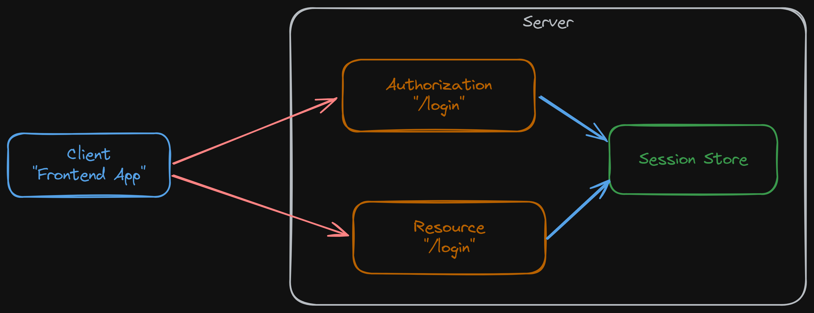
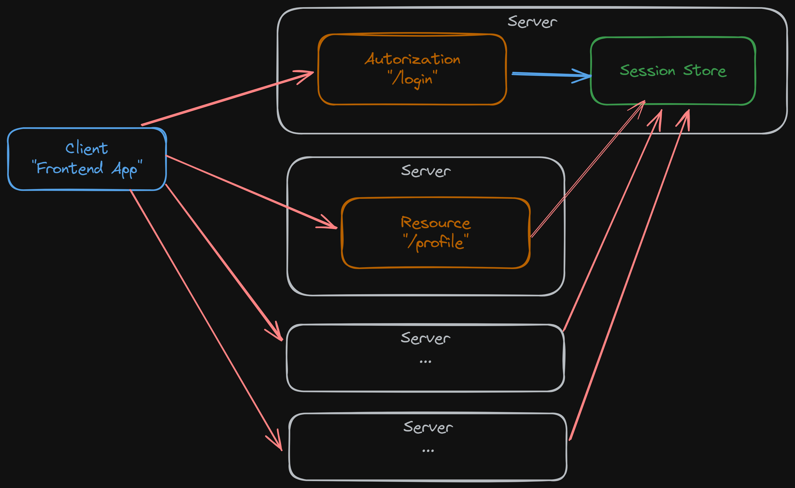
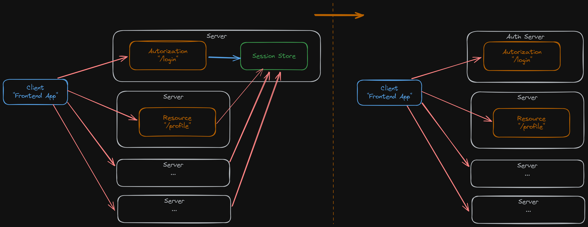
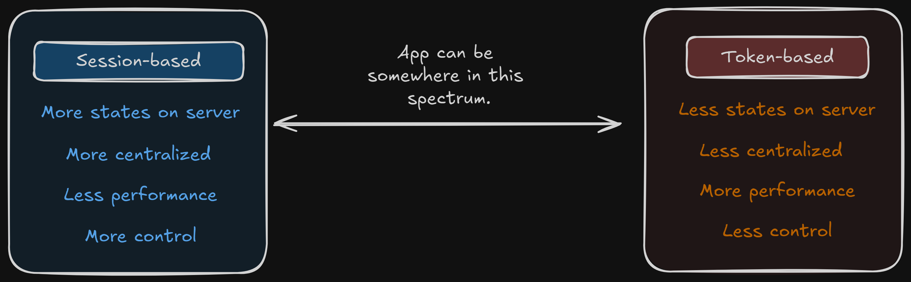

# Fullstack Development

---

# Authentication / Authorization

---

# Part 3: Persisting auth's state

---

# Session based

- Server is responsible for creating and maintaining the user's authentication state (i.e. in a database).
- After user sign-in, the server sets a cookie that contains the session ID and sends it to the browser.
  - The browser will include it in all further requests.
  - The server will use the cookie to identify the current user session from the database.

---

# Session based

- Users' auth states are in DB.
- Need to query DB at every request.

## 

---

# Session based

- This could be a problem in distributed system with centralized `auth` server.
- Session store could be overloaded.

---

### Can do something like this?

_Note that the right system is not exactly what you want to do._

---

# Token-based

- `token` is a cryptographically signed piece of data that contains information about the authenticated user and their access permissions.
- The server will only have to verify the validity of the token rather than having it stored in a database.
  - Reduces the amount of state that needs to be stored on the server.
- While other token formats exist, JSON Web Tokens (JWTs) have become the prevailing standard for token-based approach.

---

# Clarification

- It is better to think about where you put users' `auth` state.
  - `Session-based`: more states in server (_"stateful"_)
  - `Token-based`: more states in client (_stateless_)
- Using JWTs does not automatically means you are using token-based approach.
  - You can put JWTs in session cookie.
- The system can contain both approaches.

---

- When going token-based approach, you are losing **control** over user's state and you are making your system **less secured**.

---

# Please do not do this.

- It is tempting to go 100% stateless using token-based approach (JWT) to avoid dealing to storing information on server.
- Be aware of these concerns: [(REF1)](https://redis.io/blog/json-web-tokens-jwt-are-dangerous-for-user-sessions), [(REF2)](https://authjs.dev/concepts/session-strategies).
  - List 1
  - List 2

---

# Considering token-based approch

- Do you have distributed system with centralized `auth` server?
- If you are concerned about hitting database too much, have you considered `redis`?
- Modern techniques for tokens are quite complex (_and will probabably require database anyway_):
  - Refresh tokens (with allowed list)
  - Revoked list
  - Token rotation

---

> If you don't have database table storing `auth` in your system, there is something wrong.
