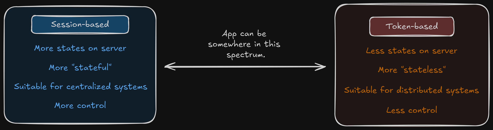

# Fullstack Development

---

# Authentication / Authorization

---

# Part 3: Persisting auth's state

---

# Session based

- Server is responsible for creating and maintaining the user's authentication state (i.e. in a database).
- After user sign-in, the server sets a cookie that contains the session ID and sends it to the browser.
  - The browser will include it in all further requests.
  - The server will use the cookie to identify the current user session from the database.

---

# Token-based

- A "token" is a cryptographically signed piece of data that contains information about the authenticated user and their access permissions.
- The server will only have to verify the validity of the token rather than having it stored in a database.
  - Reduces the amount of state that needs to be stored on the server.
- While other token formats exist, JSON Web Tokens (JWTs) have become the prevailing standard for token-based approach.

---

# Not one or another

Most systems use both approches in various degrees.

---

# Moving toward token-based approch

- Think carefully about this since you are losing control over user's state.
  - You are making your system less secured.
