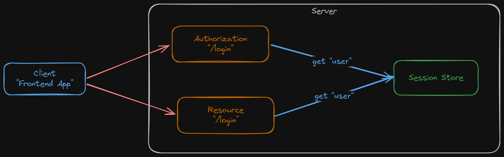
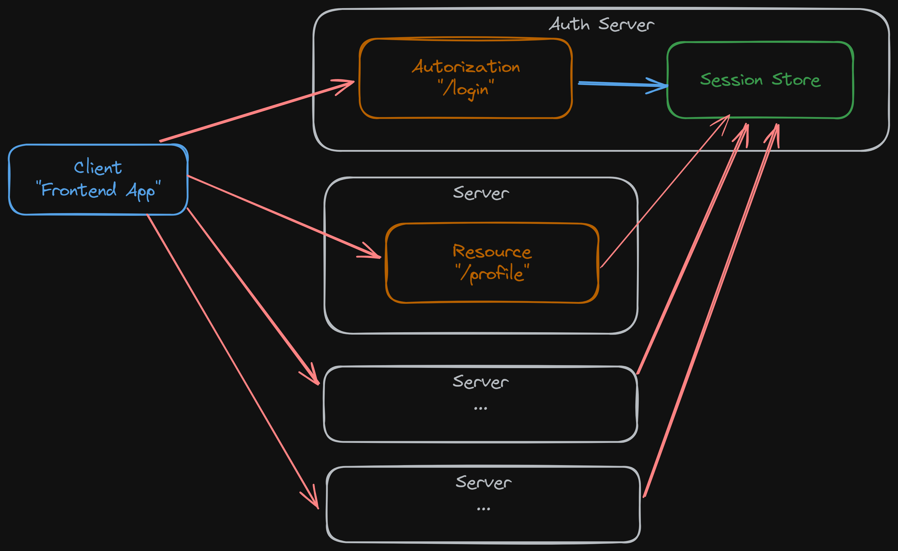

<style>
@import url('https://fonts.googleapis.com/css2?family=Prompt:ital,wght@0,100;0,300;0,400;0,700;1,100;1,300;1,400;1,700&display=swap');

    :root {
    font-family: Prompt;
    --hl-color: #D57E7E;
}
h1 {
  font-family: Prompt
}
</style>

# Fullstack Development

---

# Authentication / Authorization

---

# Part 3: Persisting auth's state

---

> Part 3: Social signing up/in

# Section 3A: Session-based vs token-based

---

# Session based

- Server is responsible for creating and maintaining the user's authentication state (i.e. in a database).
- After user sign-in, the server sets a cookie that contains the session ID and sends it to the browser.
  - The browser will include it in all further requests.
  - The server will use the cookie to identify the current user session from the database.

---

# Session based

- Users' auth states are in DB.
- Need to query DB at every request.



---

# Session based

- This could be a problem in distributed system with centralized `auth` server.
- Session store could be overloaded.



---

### Can do something like this?


_Note that the right system is not exactly what you want to do._

---

# Token-based

- `token` is a cryptographically signed piece of data that contains information about the authenticated user and their access permissions.
- The server will only have to verify the validity of the token rather than having it stored in a database.
  - Reduces the amount of state that needs to be stored on the server.
- While other token formats exist, JSON Web Tokens (JWTs) have become the prevailing standard for token-based approach.

---

# JWT Test

- `git clone -b jwt https://github.com/fullstack-67/auth-mpa-v2.git auth-jwt`
- `pnpm i`
- `npx tsx ./src/test.ts`

---

# Clarification

- It is better to think about where you put users' `auth` state.
  - `Session-based`: more states in server (_"stateful"_)
  - `Token-based`: more states in client (_stateless_)
- Using JWTs does not automatically means you are using token-based approach.
  - You can put JWTs in session cookie.
- The system can contain both approaches.

---


- When going token-based approach, you are losing **control** over user's state and you are making your system **less secured**.

---

# Please do not do this.

- It is tempting to go **100% stateless** using token-based approach (JWT) to avoid dealing to storing information on server.
  - **You don't know who is using your system!**
- Also, be aware of these concerns ([Ref1](https://redis.io/blog/json-web-tokens-jwt-are-dangerous-for-user-sessions), [Ref2](https://authjs.dev/concepts/session-strategies)).
  - Cannot really log out users.
  - Cannot really block users.
  - Stale data
  - Limited storage
  - JWT could be decrypted at some point.

---

# Considering token-based approch?

- Do you have distributed system with centralized auth server?
  - If no, go session-based.
- You are concerned about overloading your database.
  - Have you considered `redis`?

---

# Considering token-based approach?

- Have you consider the fact that modern token secuity is quite complex (_and will require database anyway_)?
  - Refresh tokens (revokable)
  - Allowed/Revoked lists
  - [Token rotation](https://auth0.com/docs/secure/tokens/refresh-tokens/refresh-token-rotation)
  - [Token behavior detection](https://help.okta.com/en-us/content/topics/security/proc-security-behavior-detection.htm)

---

# Bottom line

> If you don't have database table storing `auth` states, your system lacks **visibility** and **security response** against cyber attacks.

---

> Part 3: Persisting auth's state

# Section 3B: Session management with `express-session`

---

# Cookie

- A small piece of data a server sends to a user's web browser.
- The browser may:
  - Store cookies
  - Create new cookies
  - Modify existing ones
  - Send it back to the server with later requests.
- Cookies enable web applications to store limited amounts of data and remember state information
  - By default the HTTP protocol is `stateless`.

---

# Cookie


---

# Cookie mechanism

- Server `response` header

```
HTTP/1.1 200 OK
Set-Cookie: connect.sid=s%3AUDOk...; Path=/; Expires=Fri, 30 Aug 2024 02:57:01
GMT; HttpOnly; SameSite=Lax
```

- Subsequent browser `request` header

```bash
GET / HTTP/1.1
Cookie: connect.sid=s%3AUDOk
```

---

# Cookie attributes

- `Path=<path-value>`
  - Path that must exist in the requested URL for the browser to send the Cookie header
- `Expires=<date>`
  - Maximum lifetime
- `Max-Age=<number>`
  - The number of seconds until the cookie expires.

---

# Cookie attributes

- `HttpOnly`

  - Forbids JavaScript from accessing the cookie (`Document.cookie`).
  - Prevent against cross-site scripting (XSS).

- `SameSite`
  - Controls whether or not a cookie is sent with cross-site requests
  - `Strict` / `Lax` / `None`
  - Will come back to this later.

---

# Setup

`git clone -b session https://github.com/fullstack-67/auth-mpa-v2.git auth-session`
`pnpm i`
`npm run db:reset`
`npm run dev`

---

# Highlighted package

`package.json`

```json
{
  "express-session": "^1.18.0"
}
```

---

# Usage

`session.ts`

```ts
import session from "express-session";
// ...
const sessionIns = session({
  // Options
});
```

`index.ts`

```ts
app.use(sessionIns);
```

---

# How does `express-session` work?


---

# How does `express-session` work?


---

# Session store

- Storage mechanism for sessions.
- If you don't supply anything, it just uses a `memory` store.

  - Not persisted across server restarts

- [Other choices](https://expressjs.com/en/resources/middleware/session.html#compatible-session-stores)

---

# Experiments

- Clear all cookies in browser and visit the `url`.
  - No cookie sent from server.
- Set `count` in `req.session`
  - Cookie saved in store.
  - Cookie sent from server.
- Open new tab/window.
  - Cookie are sent with client requests.
- Open Edge.
  - New sessionse are created.
- Set `useragent`.

---

# Session options

```ts
const sessionIns = session({
  secret: "My Super Secret",
  cookie: {
    path: "/",
    httpOnly: true,
    secure: NODE_ENV === "production" ? true : false,
    maxAge: 60 * 60 * 1000,
    sameSite: "lax",
  },
  saveUninitialized: false,
  resave: false,
  store: SQLiteStoreInstance as session.Store,
});
```

---

# Session options

- `saveUninitialized`
  - Forces a session that is "uninitialized" to be saved to the store.
  - A session is uninitialized when it is new but not modified.
- `resave`
  - Forces the session to be saved back to the session store, even if the session was never modified during the request.

---

# `saveUninitialized`


---

# `resave`


---

# Remaining task

- We need a way to link authentication state to session.

---

> Part 3: Persisting auth's state

# Section 3C: Session + authentication

---

# We need to

- Store user information in a session store when user sign in.
- Retrive user information for route handlers for subsequent requests.
- Destroy sessions when users log out.

---

# Two session middlewares

- `express-session`
  - Middleware to retrieve session from a session store.
    - Imagine that this session contains `userId`.
- `passport.session()`
  - Middleware to retrive complete user information from `userId`.
- [Ref 1](https://stackoverflow.com/q/22052258), [Ref 2](https://stackoverflow.com/a/27030089)
