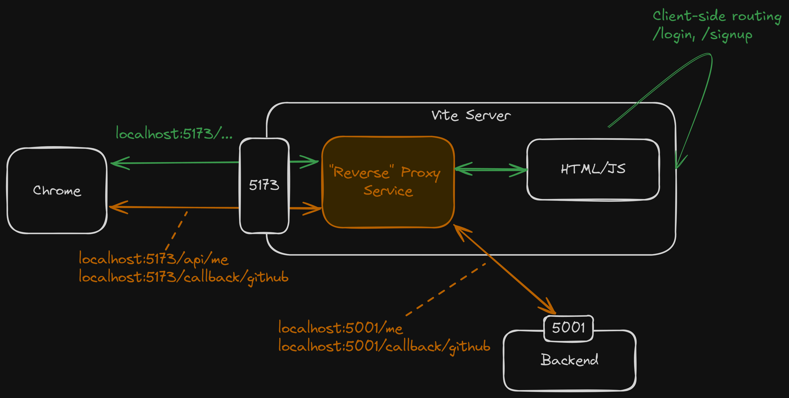

<style>
@import url('https://fonts.googleapis.com/css2?family=Prompt:ital,wght@0,100;0,300;0,400;0,700;1,100;1,300;1,400;1,700&display=swap');

    :root {
    font-family: Prompt;
    --hl-color: #D57E7E;
}
h1 {
  font-family: Prompt
}
</style>

# Fullstack Development

---

# Authentication / Authorization

---

# Part 4: SPA

---

# Backend

- Routes now return json / redirect header instead of html.
- Created `GET /me` route for clients to check their `auth`' states.
- Apart from that, there is very mininal change, surprisingly.

---


---

# Frontend

- Created (client-side) routing.
- Created logic to query/update `auth`'s state.
- Modified proxy server to take care of `Callback URL` (bypass client-routing).
- Created signup form/login and other UI.

---

# Highlighted packages

```json
{
  "@tanstack/react-query": "^5.52.1",
  "react-router-dom": "^6.26.1"
}
```

---

# Client-side routing

`src/App.tsx`

```ts
import { createBrowserRouter, RouterProvider } from "react-router-dom";
const router = createBrowserRouter([
  {
    path: "/",
    element: <Layout />,
    children: [
      {
        path: "/",
        element: <Home />,
      },
    ],
  },
]);
```

---

# Client-side routing

`src/App.tsx`

```ts
function App() {
  return (
    // ...
    <RouterProvider router={router} />
    // ...
  );
}

export default App;
```

---

# Getting auth state

`src/hooks/useAuth.ts`

```ts
import { useQuery } from "@tanstack/react-query";
// ...
function getMe() {
  return axios.get<AuthData>("/api/me");
}

function useAuth() {
  // Queries
  const { data, error, refetch } = useQuery({
    queryFn: getMe,
    // Other options
  });
  return { user: data?.user, sessions: data?.sessions, error, refetch };
}
```

---

# Getting auth state

`src/components/Nav.tsx`

```ts
const Nav: FC = () => {
  const { user } = useAuth(); 👈👈👈
  // ...
  return (
    <nav>
      // ...
    </nav>
  );
};

export default Nav;
```

---

# Handle `Callback URL`

`vite.config.ts`

```ts
export default defineConfig({
  plugins: [react()],
  server: {
    proxy: {
      "/api": {
        // ...
      },
      "/callback": { 👈👈👈
        target: "http://localhost:5002",
      },
    },
  },
});
```

---



---

# Note

- The use of proxy server solve cookie and CORS issues.
- Cookies for a given host are shared across all the ports on that host.
- The "same-origin policy" used by web browsers isolates content retrieved via different ports.
