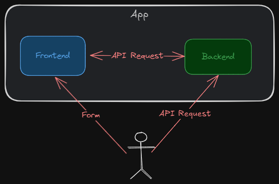

<style>
@import url('https://fonts.googleapis.com/css2?family=Prompt:ital,wght@0,100;0,300;0,400;0,700;1,100;1,300;1,400;1,700&display=swap');

    :root {
    font-family: Prompt;
    --hl-color: #D57E7E;
}
h1 {
  font-family: Prompt
}
</style>

# Fullstack Development

---

# Form and validation

> Is your app safe?

---



---

# Case study

- `git clone -b no-check https://github.com/fullstack-67/fv-zod.git fv-no-check`

## Frontend (backend)

- `pnpm i`
- `npm run dev`

---

# Backend pitfalls (1)

- `GET` `/users` route
  - The response has `password` fields.

---

# Backend pitfalls (2)

- `POST` `/users` route

```json
{
  "firstName": "Test",
  "lastName": "Test",
  "email": "test@example.com",
  "dateOfBirth": "2024-01-01",
  "password": "1234",
  "confirmPassword": "1234"
}
```

- Try sending incomplete fields / wrong field names.
  - Internal error

---

# Backend pitfalls (3)

- Trying sending wrong year calendar.
  - Data is now not consistent.

---

# Frontend pitfalls (1)

`.env`

```bash
VITE_URL_DATA=/api/users_wrong
```

- Notice the incoming data

  - Key differences
  - Calendar year difference

- The wrong data causes blank/inconsistent display.

---

# Frontend pitfalls (2)

- Try using form
  - No input validation

---

# Wait, but I thought I used `TypeScript`.

- TypeScript catches compile-time errors.
- We are talking about **run-time** errors.

---

# We want

- Advanced/maintainable/scalable data validation
- Useful error message when validation fails
- Data sanitization (backend response)
- Logic reusability in frontend and backend codes
- Seamless combatibility with `TypeScript`
- API documentation

---

# Validation library

- `Zod`
- `Yup`
- `Typebox`

---

# `zod` basic

---

# Setup

- `git clone -b basic https://github.com/fullstack-67/fv-zod.git fv-basic`
- `pnpm i`
- `npm run dev`

---

# Validation with `zod`

---

# Setup

- `git clone -b check https://github.com/fullstack-67/fv-zod.git fv-check`

## Frontend (backend)

- `pnpm i`
- `npm run dev`

---

# Backend

`./src/utils/schema.ts`

```ts
export const zUserBase = z.object({
  // Fields
});
// Response
export const zUsersRes = z.array(zUserBase.omit({ password: true }));
```

---

# Data sanitization

```ts
// * Endpoint: get users
app.get("/users", (req, res) => {
  res.json(zUsersRes.parse(data)); // 👈👈👈
});
```

---

```ts
export const zUsersCreateReq = zUserBase
  .omit({ id: true, createdAt: true })
  .extend({
    confirmPassword: z.string().min(1, { message: "Confirm password" }),
  })
  .refine((data) => data.password === data.confirmPassword, {
    message: "Passwords don't match",
    path: ["confirmPassword"],
  });

// Get user
export const zUsersRes = z.array(zUserBase.omit({ password: true }));
```

---

# Try it yourself

http://10.10.12.140:5176
http://10.10.12.140:5175/api-docs

---

# Form UX improvement

- "Real-time" validation
- Prevent submission if input is not valid.
- Prevent double submission.
- Prevent typing during submission.
- Auto-focus the wrong input.

---

# Real-time validation

- Use `useEffect` to trigger schema validation
- Store errors in `errors` state.
- Keep track of when user touches the form.
  - Prevent premature validation.
  - Store `touch` state

---

# Form disable

- Keep track of `valid` state.
- Keep track of `submission` state.

---

# Spiral out of control

- Too many states
- Too many logics
- Not reusable

---

# Form library

- Help you handle form states and logics in a reusable manner.

  - It is essentially a custom hook.
  - Integrates seemlessly with validation library.

- Popular libraries
  - `Formik`
  - `React Hook Form`
